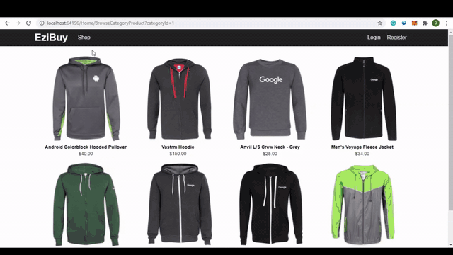

#  E-commerce Shopping Store 
* Implemented using C#, ASP.NET, MVC, Bootstrap, HTML, CSS, JS, AJAX, jQuery (In Progress).

## Solution Structure

* The solution functionality divided into three separate parts based on roles either User, Guest or Admin.

- Admin can perform several operations like:
	- Admin can see the list of products
	- Admin can add, update or delete the products from product list
	- Admin can see the registered users list
	- Admin can update or delete user from users list
	- Admin can manage the promotional product list and can add into carousel
- User can login or register
- User can perform CRUD operations like
	- User can add/remove product to/from his cart
	- User can update his personal information
- Guest can only explore the listed products

## Building the application
* Need Visual Studio Community Edition or Visual Studio Code.
* Need to Install Node.Js in system as application uses the NuGet Package Manager or NPM to install the required packages and libraries.
* Clone the project in VS and open the solution in VS.
* Open the solution folder in Command Prompt and Run the commands npm install, npm start.
* Or Open the solution within Visual Studio and restore NuGet packages.
* To import the database run following commands using package manager console:
	* PM> enable-migrations
	* PM> Update-Database -Verbose
* Build the solution and run in your choice of browser.

## Project View

## Admin View

